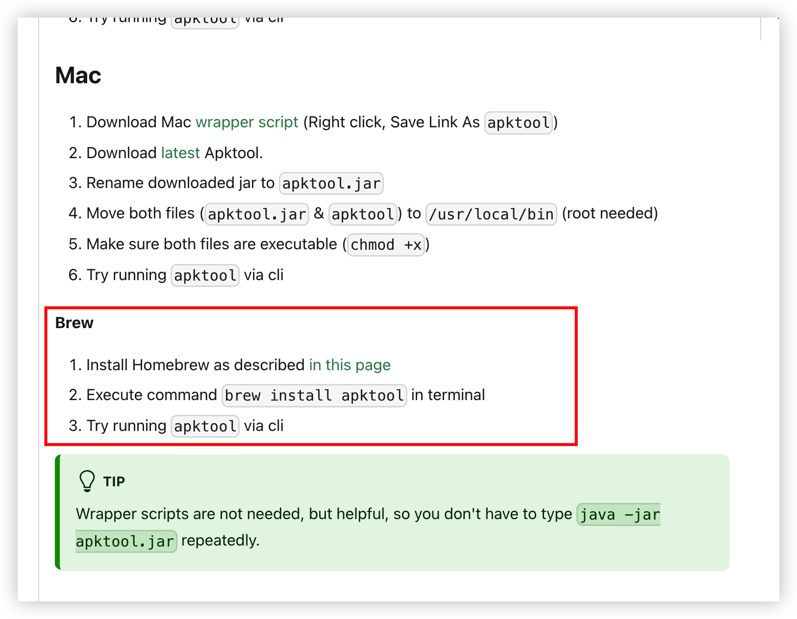
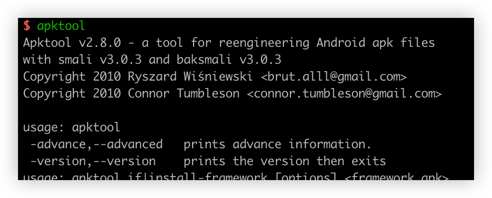

[TOC]

> [apktool](https://apktool.org/docs/install/)  
> [JD-GUI](http://java-decompiler.github.io/)  
> [dex2jar](https://github.com/pxb1988/dex2jar)  

# Mac环境配置

## apktool安装

安装完输入`apktool`提示如果表示安装成功

## 安装dex2jar

`brew info dex2jar`

## 安装jd-gui

`brew install jd-gui`

# 使用

`apktool d test.apk`

`d2j-dex2jar test.apk`执行后生成jar文件`dex2jar test.apk -> ./test-dex2jar.jar`

`jd-gui`打开生成的`jar`包就可以看到代码内容

# 问题

## jd-gui打不开

**jd-gui显示包内容然后Contents这个文件夹，大家可以找到：Info.plist这个文件，打开它搜索”1.8+“然后把”+“删除掉，保存，大功告成！！！**
